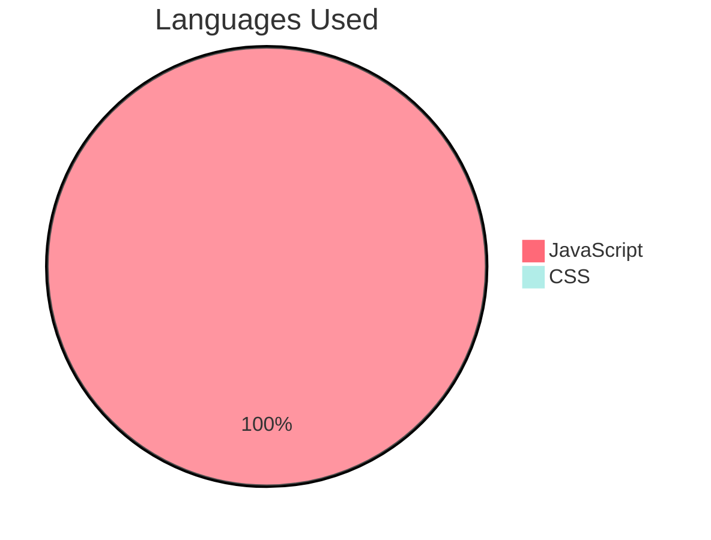

# TV SHOW Application

A web app using DOM manipulation to lists all the shows.
The user can select a specific show, can search through the shows or through the episodes of a specific show.

## Deployed Website

Access the deployed version of the application: <a href='https://cyf-lorenacapraru-tv.netlify.app/'>TV SHOW</a>

## Inside The App


## Features

- [x] The app lists all the shows.
- [x] The user can select one show.
- [x] The user can select an episode of a show.
- [x] The user can search through the shows.
- [x] The user can search through the episodes.

## Technologies Used:

- [x] JavaScript DOM Manipulation
- [x] CSS, HTML


## Pie Chart Of Languages Used



## Installation

**Clone the repository:**

```bash
git clone github.com/LorenaCapraru/tv-show-dom-project
```

**Install dependencies:**

```bash
npm install
```

**Start the development server:**

```bash
npm start
```
